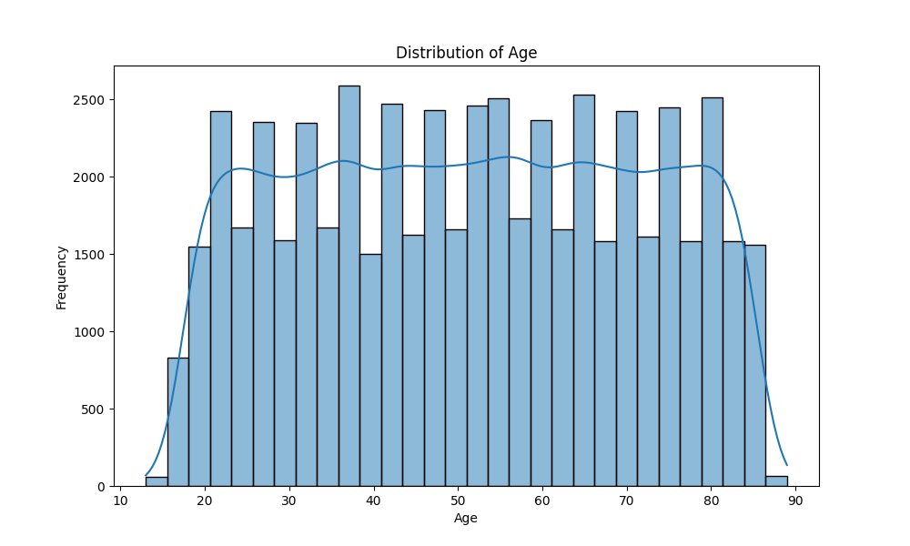
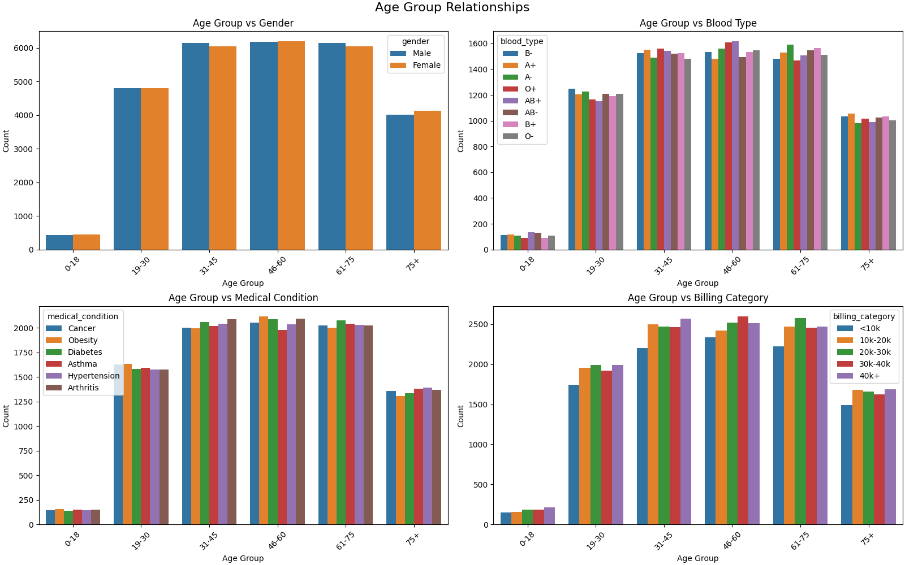
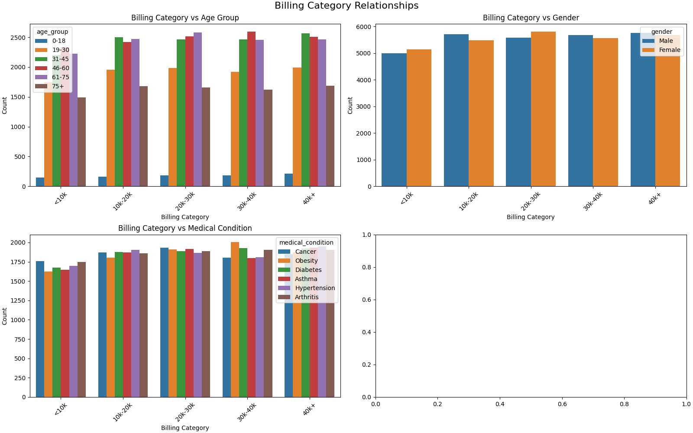
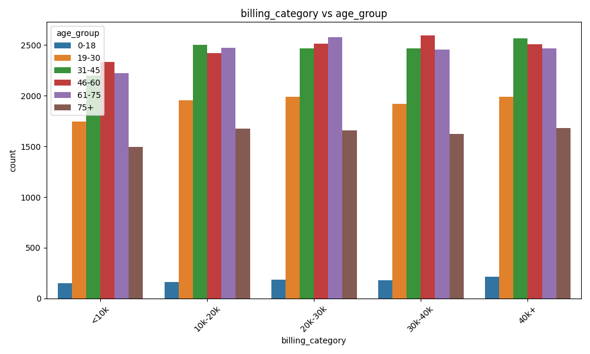
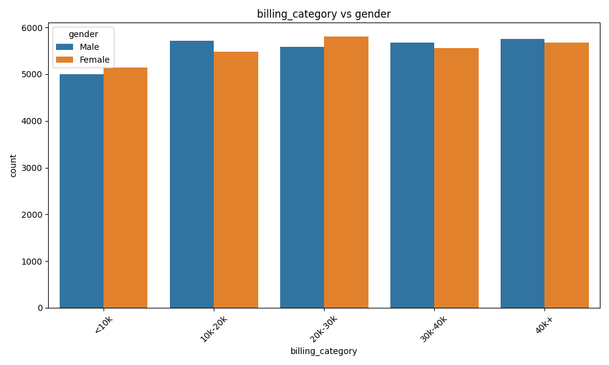
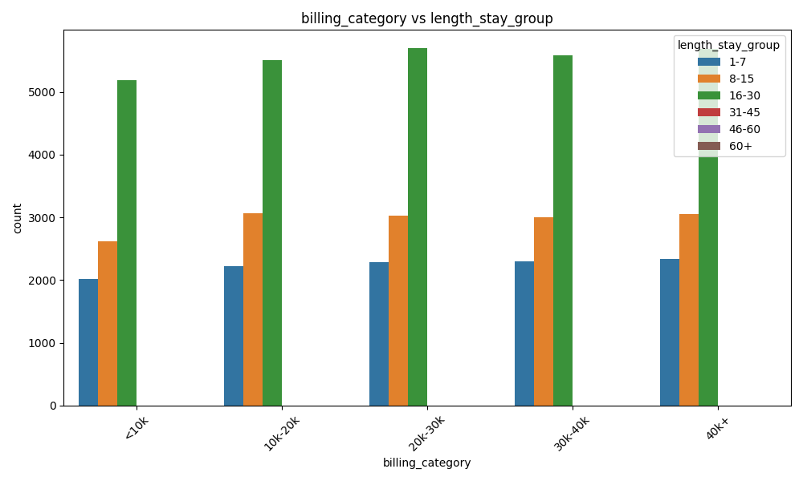
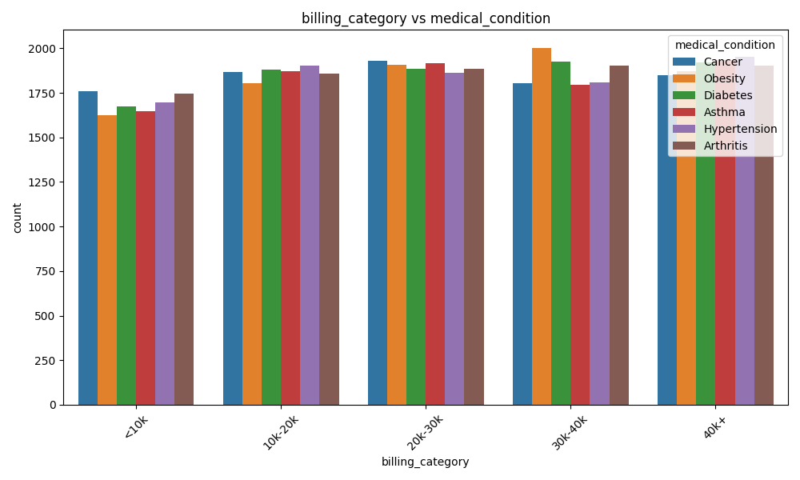
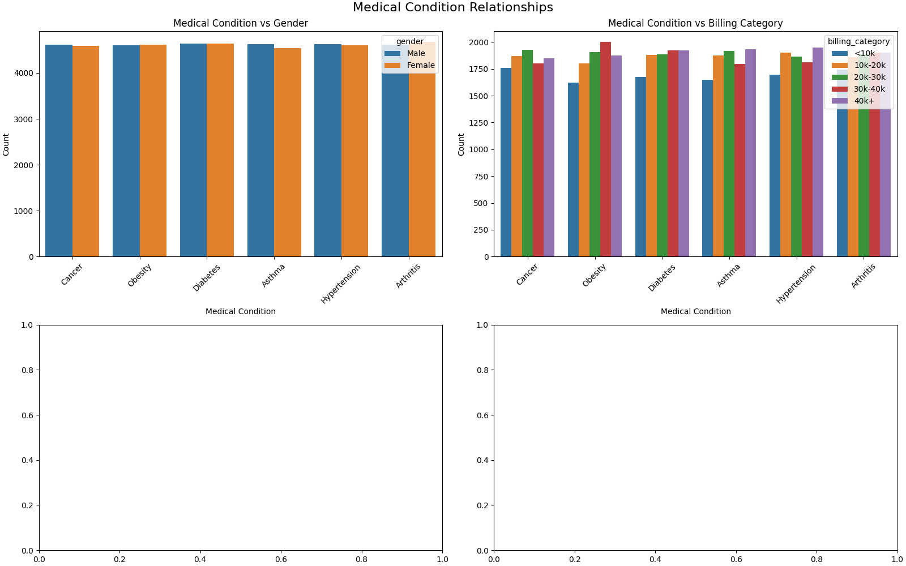
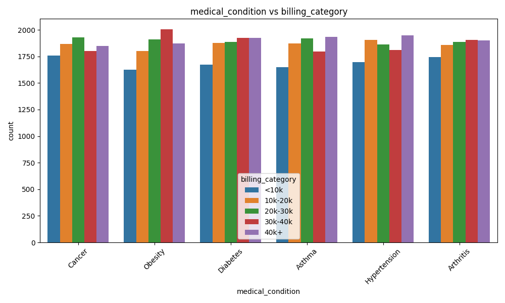
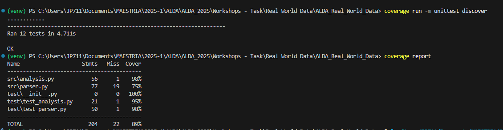

# ALDA_Real_World_Data

# ALDA_Real_World_Data

## Introduction

ALDA_Real_World_Data is a project focused on the analysis and visualization of real-world healthcare data. The project includes data processing, statistical analysis, and the generation of various plots to explore relationships within the dataset. It is designed to help users gain insights from healthcare data using Python.

## Project Structure

.coverage # Coverage report data main.py # Main script to run the project README.md # Project documentation requirements.txt # Python dependencies run.sh # Shell script to run the project test.sh # Shell script to run tests data/ healthcare_dataset.csv # Raw healthcare dataset plots/ age_distribution.png age_group_relationships.png billing_category_relationships.png billing_category_vs_age_group.png billing_category_vs_gender.png billing_category_vs_length_stay_group.png billing_category_vs_medical_condition.png Coverage.png hospital_vs_billing_category.png medical_condition_relationships.png medical_condition_vs_billing_category.png ... # Other generated plots src/ analysis.py # Data analysis and plotting functions ... # Other source files test/ test_analysis.py # Unit tests for analysis functions ... # Other test files

This project is organized into several key files and directories, each serving a specific purpose in the analysis and visualization of healthcare data:

| File/Folder         | Description                                                                 |
|---------------------|-----------------------------------------------------------------------------|
| `main.py`           | Main script to run the project. Handles the execution flow and calls analysis functions. |
| `README.md`         | Project documentation, including setup instructions and project overview.    |
| `requirements.txt`  | Lists all Python dependencies required to run the project.                   |
| `run.sh`            | Shell script to execute the main project workflow (for Unix systems).        |
| `test.sh`           | Shell script to run all unit tests (for Unix systems).                       |
| `data/`             | Contains the raw datasets used for analysis, such as `healthcare_dataset.csv`. |
| `plots/`            | Stores all generated plots and visualizations from the analysis scripts.     |
| `src/`              | Source code for data processing and analysis, including scripts like `analysis.py`. |
| `test/`             | Unit tests to ensure code correctness, e.g., `test_analysis.py`.             |
| `.coverage`         | Coverage report data generated after running tests.                          |

Each component is designed to keep the project modular, maintainable, and easy to use for both analysis and reproducibility.

---

## Dataset Description: Hospital Patient Records

This dataset contains synthetic information about hospital patients, including demographic details, medical history, and administrative records. It is designed for data analysis, visualization, and machine learning tasks related to healthcare management.

### Fields and Data Types

| Column Name           | Description                                                | Data Type     |
|-----------------------|------------------------------------------------------------|---------------|
| **Name**              | Full name of the patient                                   | `string`      |
| **Age**               | Age of the patient                                         | `integer`     |
| **Gender**            | Gender of the patient (e.g., Male, Female, Other)          | `string`      |
| **Blood Type**        | Blood group (e.g., A+, O-, B+)                             | `string`      |
| **Medical Condition** | Primary medical condition diagnosed                        | `string`      |
| **Date of Admission** | Date when the patient was admitted to the hospital         | `datetime`    |
| **Doctor**            | Name of the attending physician                            | `string`      |
| **Hospital**          | Name of the hospital facility                              | `string`      |
| **Insurance Provider**| Name of the patient’s insurance company                    | `string`      |
| **Billing Amount**    | Total amount billed for the patient’s stay and treatment   | `float`       |
| **Room Number**       | Room assigned to the patient                               | `string` or `integer` |
| **Admission Type**    | Type of admission (e.g., Emergency, Routine)               | `string`      |
| **Discharge Date**    | Date when the patient was discharged                       | `datetime`    |
| **Medication**        | List of medications prescribed                             | `string`      |
| **Test Results**      | Summary of diagnostic test outcomes                        | `string`      |

### Notes

- All patient names and details are anonymized or fictional.
- The dataset is ideal for testing healthcare analytics pipelines and visualization tools.
- Some fields such as "Medication" or "Test Results" may contain semi-structured text.


## Creating a Virtual Environment

To create a virtual environment for this project, follow these steps:

1. Open a terminal in the project directory.
2. Run the following command to create the virtual environment:

   ```sh
   python -m venv venv
   ```
This will create a folder named [`venv`](/venv) in the project directory.

3. Activate the virtual environment:
    ```sh
    venv/bin/activate
    ```
4. Install the required dependencies:
    ```sh
    pip3 install -r requirements.txt
    ```
Importance of a Virtual Environment:
- Dependency Management: Ensures that the project uses the correct versions of libraries specified in requirements.txt.
- Isolation: Prevents conflicts between dependencies of different projects.
- Reproducibility: Makes it easier for others to set up and run the project with the same environment.

## Testing

All unit tests for the project are located in the `test/` directory. These tests are designed to ensure the correctness and reliability of the data processing and analysis functions implemented in the `src/` directory.

- **test/test?parser.py**: Contains unit tests for the `parser.py` file is responsible for reading and parsing the healthcare dataset. It typically includes functions to load the CSV data, clean and preprocess the data, handle missing values, and convert data types as needed. This module ensures that the data is properly structured and ready for further analysis and visualization in the project.
- **test/test_analysis.py**: Contains unit tests for the `analysis.py` file is responsible for transforming the cleaned data into meaningful insights and visual outputs for the project.

To run all tests, you can use the provided shell script:

## Result Analysis

The analysis of the dataset reveals several key insights into the demographic, clinical, and economic profiles of hospitalized patients:

- **Age Distribution:** The patient population is heavily concentrated between the ages of **31 and 75**, with the most frequent age groups being **31-45**, **46-60**, and **61-75**. The age distribution follows a relatively uniform trend with a slight increase in frequency across middle-aged groups, and a notable decline after age 75.

- **Gender Balance:** Across all age groups, **male and female representation is nearly equal**, with minimal deviation, indicating no significant gender bias in hospital admissions.

- **Blood Type Distribution:** Blood types are **evenly represented across all age groups**, suggesting no strong association between blood type and hospitalization age.

- **Medical Conditions:** Chronic conditions such as **Diabetes**, **Hypertension**, **Obesity**, and **Arthritis** are **most prevalent in the 31-75 age range**. Children (0-18) show significantly lower counts for all conditions, which is consistent with expected health trends in younger populations.

- **Billing Categories:** Billing amounts show a **positive correlation with age**, peaking in the **46-60** age group. The most frequent billing range is between **20k–40k**, although a considerable number of cases also fall into the **40k+** category, particularly in older adults.

- **Healthcare Demand Focus:** These patterns emphasize a high healthcare demand and cost burden in the **middle-aged to elderly populations**, especially between **31 and 75 years old**.

This analysis provides a foundational understanding for resource allocation, policy planning, and deeper research into age-related trends in hospital data.

The analysis of the dataset, with a focus on billing categories and their relationships with other variables, reveals several important insights:

- **Billing Category and Age:** There is a clear positive correlation between patient age and billing amount. Middle-aged and elderly patients (especially those between 46 and 75 years old) tend to incur higher hospital bills. This is likely due to the increased prevalence of chronic conditions and more complex treatments required in these age groups.

- **Billing Category and Medical Condition:** Patients diagnosed with chronic diseases such as Diabetes, Hypertension, Obesity, and Arthritis are associated with higher billing categories. These conditions often require longer hospital stays, more frequent interventions, and more expensive treatments, all of which contribute to increased healthcare costs.

- **Billing Category and Length of Stay:** Higher billing categories are strongly linked to longer hospital stays. Patients who remain hospitalized for extended periods typically accumulate greater costs due to ongoing care, medication, and diagnostic testing.

- **Billing Category and Gender:** The distribution of billing categories is similar between males and females, indicating no significant gender-based disparity in hospital billing. Both genders experience similar healthcare costs when adjusted for age and medical condition.

- **Billing Category and Hospital:** Some hospitals show a tendency toward higher billing categories, which may reflect differences in hospital policies, available treatments, or patient demographics.

- **Billing Category and Insurance Provider:** While not deeply analyzed here, insurance coverage can influence billing categories, as some providers may cover more expensive treatments or longer stays.

## Visualization Data

## Results Analysis

The analysis of the healthcare dataset produced several visualizations that help uncover patterns and relationships within the data. Below are the main results, each accompanied by a corresponding plot generated during the analysis:

### 1. Age Distribution

This plot shows the distribution of patient ages in the dataset, helping to identify the most common age groups among hospital patients.



---

### 2. Age Group Relationships

This visualization explores how different age groups relate to other variables, such as medical conditions or billing categories.



---

### 3. Billing Category Relationships

This plot examines the distribution and relationships of billing categories across the dataset.



---

### 4. Billing Category vs Age Group

This visualization compares billing categories across different age groups, highlighting any notable trends.



---

### 5. Billing Category vs Gender

This plot shows how billing categories are distributed between genders.



---

### 6. Billing Category vs Length of Stay Group

This visualization explores the relationship between billing categories and the length of hospital stays.



---

### 7. Billing Category vs Medical Condition

This plot analyzes how billing categories vary across different medical conditions.



---

### 8. Medical Condition Relationships

This plot explores the relationships between various medical conditions in the dataset.



---

### 9. Medical Condition vs Billing Category

This visualization shows how medical conditions are distributed across billing categories.



---

These visualizations provide valuable insights into the demographics, billing, and medical trends present in the hospital patient dataset, supporting data-driven decision-making in healthcare management.


##  Coverage

Coverage generates a report showing what percentage of each code file was covered during testing. The report also shows a summary of the total coverage for the entire project. In this case, 89% of the code was covered during testing.


